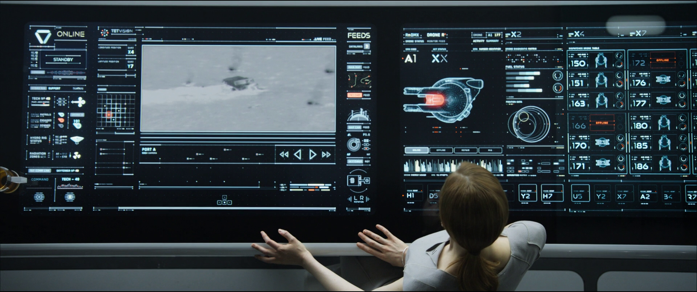

# react-aldebarion

**BE CAREFUL: this module is still in development, you should not use it except if you are ready to debug it yourself. A first release will be delivered soon.**

> Do not hesitate to involve yourself.

**React-Aldebarion** is the front-end framework built for the future.



This framework helps you to:

* design interfaces for futuristic smart screens, touch tables and HUDs.
* implement user interfaces for long term application and productivity based on maximum ergonomy and timeless design
* increase efficiency with adaptive interfaces based on human experience

It is very adapted to implement interfaces for your control table, HUDS, dashboards, etc.

## Getting started


### Installation
```bash
# with npm
$ npm install react-aldebarion
# with yarn
$ yarn react-aldebarion
```

### Development

```bash
# with npm
$ npm start
# with yarn
$ yarn start
```

## Guidelines

### Minimalism

* kind of scandinavian refined style
* limit of austere
* clean
* straight


Focus on what is important

### Consistency

* consistency over time, applications and devices
*


### Efficiency

* give priority to efficiency
* long-term interface

### Multi devices

* ensure responsiveness compatible with all platforms including computers, smartphone, tablets, large screens, ambient devices and HUDs.
* use a minimal set of contrasted colors to manage even the most lightning environments
* ensure continuity between devices: the user can begin on one device and then switch to another device without degradation of experience


### Ergonomy

* accompany the look of the user: display everything with transition
* do not use no frills except to catch the user attention
* integrate several levels of reading

### Adaptation to user

* make interface adaptable/adaptive to user


## Inspirations

* https://digitalsynopsis.com/design/cinema-palettes-famous-movie-colors/


## Libraries

* https://www.grafikart.fr/formations/webpack/react-hot-reload
* https://ezgif.com/speed/ezgif-1-a119d227cd72.gif
